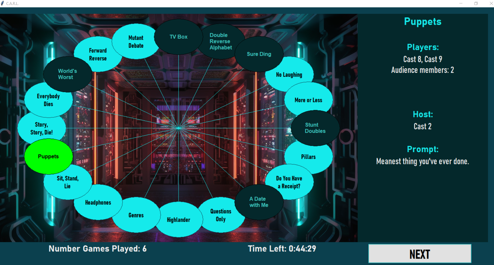

# improv_randomizer
`improv_randomizer` is a simple tool to run improv short games in a random order and with random players.

The following items are customizable:
- The **names of cast members**, among which players will be drawn for each game.
- The **games**, among which the games to play will be picked, with their respective characteristics.
- The total **duration** of a game session.
- The background image for the screen.
- A list of **prompts** to use randomly for game which do not explicitely given a specific prompt.

## How it works?:
- Each time the `Start`/`Next` button is clicked, a new game is randomly picked.



- For each game, the correct number of players is drawn from the cast, and one cast member is drawn as host. Players are randomly picked from the cast in a way that keeps cummulative participation by each member as player and as host more of less equal when many games are played.
- The game name, the selected players and the host are brought to the screen, as well as a prompt. When the game requires audience members to join on stage, their number will be indicated as well.
- A count down is started when the first game starts, from the defined total duration. When the counter reaches zero, the game session ends. 
- A sound is played at each game transition, when the session starts and when it ends.

## Customization:
- By default, the package will look for configuration information in file `config.cfg`, if it exists, and in file `config-default.cfg`  otherwise. The default configuration file comes with repo.
- The configuration file defines four values (see below for default values):
  - `duration-minutes = 45`
  - `cast = cast.txt`  (the text file name where the cast member names are stored)
  - `games = games.json` (the JSON file name where the games info are stored)
  - `prompts =  prompts.txt` (the text file name where the random prompts are stored)
  - `cfg-folder` =  (a folder under `config` where configuration files are stored, by default, files are directly under `config`)
  - `background-image` = bg_1100x700.png

- A jupyter notebook in the project root `cast-configuration-tool.ipynb` makes it easier to change cast member's names, update games and update prompts.

    
    
    
- For each game, it is possible to exclude one or several cast members as player or host. When names are in the exclusion list for a specific game, their name will not be picked in the corresponding role. It is also possible to restrict hosting to a specific list of cast member, that is the host will only be picked in the list provoded for the game.

    

- The `games.json` file has the following structure, with the same entries for each game. _Note that `"description"` and `"tips"` are currently not used_:
```json
{
    "0": {
        "name": "Game 1 name ",
        "nbr_players": 4,
        "nbr_audience": 0,
        "prompt": "What are four of your favorite TV channels?",
        "exclude": ["Actor 1"],
        "host_include": [],
        "host_exclude": [],
        "description": null,
        "tips": null
    },
    "14": {
        "name": "Game 2 name",
        "nbr_players": 2,
        "nbr_audience": 2,
        "prompt": "None",
        "exclude": [],
        "host_include": ["Actor 3"],
        "host_exclude": [],
        "description": null,
        "tips": null
    }
}
```
- It is possible to create a configuration using a `cfg-folder`, which means the package will use the cast, games and prompts file under that `cfg-folder` instead. This allows to create several custom configurations and switch from one to the other only by changing `config.cfg` or `config-default.cfg`. 
